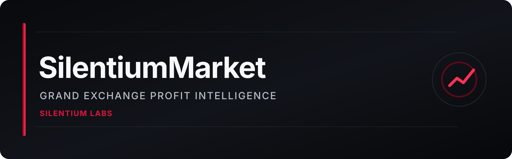
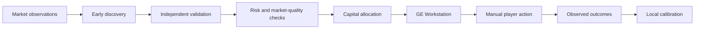

# SilentiumMarket

**OSRS Grand Exchange profit intelligence by Silentium Labs.**

SilentiumMarket is a private, closed-source market-intelligence project built to help players evaluate Grand Exchange opportunities, manage capital across GE slots, track real outcomes, and make more disciplined manual trading decisions.

> This public repository contains product documentation, public release notes, issue tracking, and security information only. The implementation is intentionally not published here.

## What SilentiumMarket is designed to do

SilentiumMarket combines a local analytics engine, a RuneLite-side execution cockpit, and a desktop command center. The system is designed around **expected executable profit**, not simply the largest visible spread.

At a high level it provides:

- **GE Workstation** — live visibility into occupied/free GE slots and manual next-action guidance.
- **MAX SMART / DAY / NIGHT** — capital-allocation modes for general use, faster daytime turnover, and multi-hour/overnight planning.
- **Multi-stage opportunity validation** — early market discovery is separated from the decision layer that can recommend risking GP.
- **Market-quality checks** — suspicious, stale, one-sided, or dislocated conditions can be rejected even when the displayed margin looks attractive.
- **Profit-confidence estimates** — plans emphasize conservative execution ranges and uncertainty rather than treating theoretical spread as guaranteed profit.
- **Personal execution learning** — observed fills can improve estimates for the individual user over time.
- **Profit tracking** — verified merch activity is separated from personal/gear/supply/quest purchases so unrelated GE activity does not corrupt merch statistics.
- **Replay and calibration** — historical outcomes are used to evaluate whether previous signals actually remained executable.
- **Watchlist and search** — item-level inspection without requiring every item to become an actionable trade.

## The core principle

SilentiumMarket is intentionally designed so that **early detection does not automatically equal a buy recommendation**.

The implementation details, formulas, model weights, thresholds, source code, and private data structures are proprietary and are not part of this repository.

## Manual execution boundary

SilentiumMarket is an advisory/analytics project. RuneScape actions remain manual: the software is not intended to click, type, submit, cancel, or edit Grand Exchange offers on the player's behalf.

See [Responsible Use](docs/RESPONSIBLE_USE.md) for the public project boundary.

## Privacy and local data

Personal trading records and observed execution history are designed to remain local to each tester. Public bug reports should never include credentials, session information, private account data, or unsanitized local logs.

See [Privacy](docs/PRIVACY.md) and [Screenshot Redaction](docs/SCREENSHOT_REDACTION.md).

## Public repository scope

This repository intentionally includes only:

- product overview documentation;
- public architecture descriptions;
- sanitized release notes;
- public security/privacy policies;
- contribution and issue-reporting templates;
- non-sensitive project media.

It intentionally excludes the private market engine, RuneLite implementation, dashboard source, launchers, proprietary models, runtime databases, test data, credentials, and private tester packages.

See [Repository Scope](docs/REPOSITORY_SCOPE.md).

## Current public milestone

The current private test line is **v10.3.1**, focused on reliability, market-data quality, progressive candidate validation, strategy-aware execution guidance, and stronger false-positive suppression.

Read the sanitized [public changelog](CHANGELOG.md).

## Status

SilentiumMarket is under private testing. It is not distributed through this repository and is not presented as an official RuneLite Plugin Hub release.

## Important limitations

No live-market tool can guarantee profit or guarantee zero false positives. Grand Exchange prices, liquidity, fill speed, and market conditions can change after a plan is generated. SilentiumMarket is designed to expose uncertainty and reject weak conditions rather than hide those limitations.

## Issues and feedback

Use GitHub Issues for sanitized bug reports, documentation problems, and feature requests. For security-sensitive matters, follow [SECURITY.md](SECURITY.md) instead of opening a public issue.

## Independence notice

SilentiumMarket is an independent Silentium Labs project and is not affiliated with or endorsed by Jagex or RuneLite.

---

© 2026 Silentium Labs. All rights reserved.
