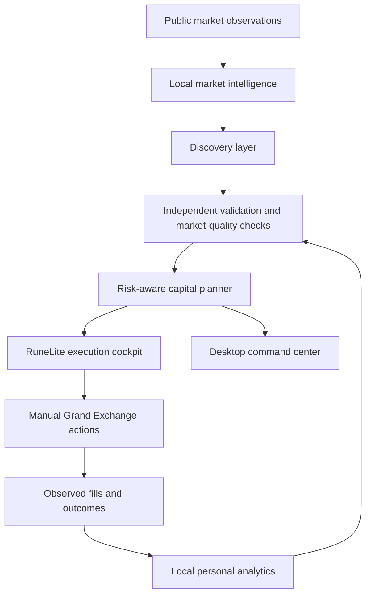

# High-Level Architecture

The public architecture is intentionally conceptual. Private source organization, formulas, thresholds, data contracts, and model internals are not disclosed.

## Market observations

Public market data supplies the external pricing and activity context used by the local intelligence layer.

## Local intelligence

SilentiumMarket processes market observations locally and maintains the user's private execution history locally.

## Validation boundary

The discovery layer is intentionally separated from the recommendation layer. Interesting movement can be monitored before it is considered safe enough to become an actionable plan.

## Capital planning

The planner considers the user's available capital, free GE capacity, execution uncertainty, and risk rather than ranking only by displayed margin.

## Execution surfaces

The RuneLite cockpit is optimized for in-game decision support. The desktop command center provides deeper analysis, history, and planning context.

## Feedback loop

Observed fills and outcomes can improve future execution estimates while preserving the requirement for current-market evidence.
