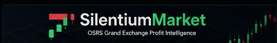
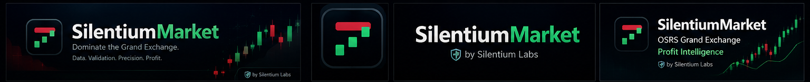
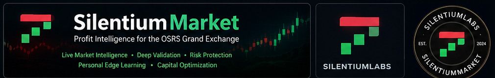
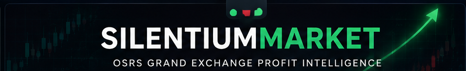
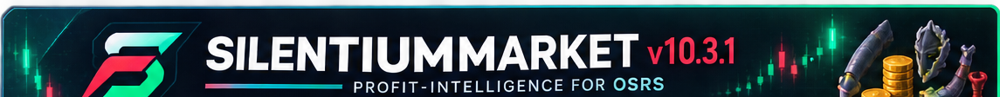
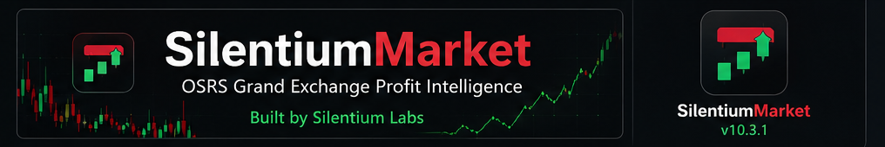
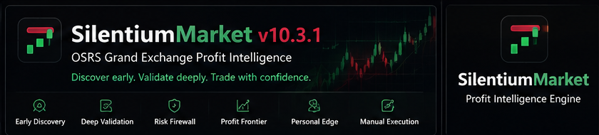

# Visual Overview

This gallery presents SilentiumMarket's visual identity and high-level product direction. The artwork is illustrative: it does not represent live account data, document implementation behavior, promise trading outcomes, or disclose formulas, thresholds, and private system details.

Detailed dashboard panels and operational figures are deliberately excluded from these public-safe compositions.

## Product intelligence

## Market-intelligence identity

## Brand system

## Workstation family

## Command-center family

## Profit-intelligence identity

## Player-control identity

## Product platform identity

SilentiumMarket remains an advisory project. Grand Exchange actions are performed manually by the player, and no visual shown here should be interpreted as a guarantee of profit.
